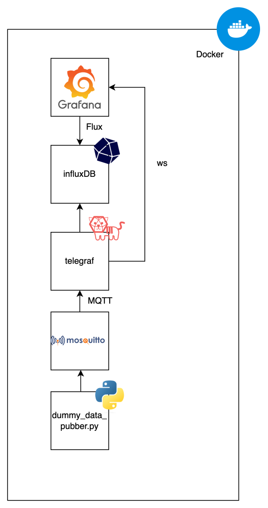

# Telegraf, InfluxDB, Grafana (TIG) Stack + MQTT broker and data generator

Get up and running with live data in TIG within minutes.

## ⚡️ Getting Started

### Prereqs: 
* Docker

Clone

```bash
git clone https://github.com/ola-tse/tig-stack.git
```

Navigate

```bash
cd tig-stack
```

Build
```bash
docker-compose build
```

Run
```bash
docker-compose up
```


[**Grafana dashboard**](http://localhost:3000)

UN/PW : admin/admin

(you can select skip when prompted with new password message)

Navigate to: Dashboards -> Sinusodial Oberservatory

[**InfluxDB Dashboard**](http://localhost:8086) 

UN/PW : admin/adminadmin



## Docker Images Tested
Some versions is set to latest i docker compose.

[**Mosquitto**]() / `2.0.15` 

[**Telegraf**](http://hub.docker.com/_/telegraf) / `1.19`

[**InfluxDB**](http://hub.docker.com/_/influxdb) / `2.1.1`

[**Grafana-OSS**](https://hub.docker.com/r/grafana/grafana-oss) / `9.2.6` 


## Antipattern disclaimers

Exposed tokens, hardcoded host references, plug and pray db migration
